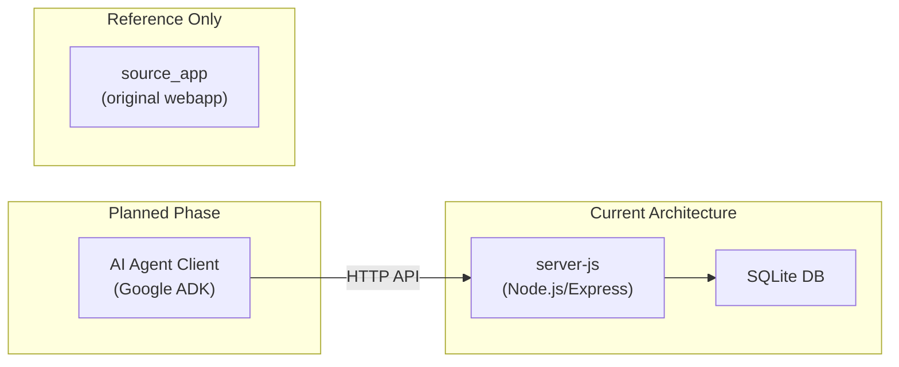

# Repository Guidelines

## Project Overview

**Avventura nel Castello** is an interactive text adventure game from the MSDOS era, later ported to a browser-based webapp. This repository contains a further port to a **client-server architecture** with a Node.js REST API backend.

- The original webapp runs entirely in the browser. The current project moves all game logic server-side and exposes it through HTTP endpoints.
- The server is fully functional and can be played by any HTTP client.
- **Next phase**: build an AI Agent client using the Google ADK (Agent Development Kit) framework. The agent will call the server API and play the game autonomously.

## Project Structure & Module Organization

```
castello/
├── server-js/          # Active Node.js/Express backend (game engine, API, SQLite, i18n)
├── agents/             # AI Agent clients (Google ADK, Python)
├── source_app/         # Original browser webapp (reference only for verifying game mechanics)
├── docs/               # Project documentation and descriptions
├── castello-api.md     # Full API reference
├── .claude/skills/     # Google ADK skill for building the agent client
├── AGENTS.md           # This file
├── .gitignore
│
├── server/             # ABANDONED - Python backend prototype (do not use)
└── docs/docs-archive-do-not-use/  # ARCHIVED - old docs (do not use)
```

### server-js/ (Active Backend)

The working server application. Node.js/Express REST API with SQLite persistence.

```
server-js/
├── app.js                  # Express entry point (port 3000)
├── db.js                   # SQLite database layer (sql.js)
├── swagger.js              # OpenAPI/Swagger configuration
├── package.json
├── routes/
│   ├── register.js         # POST /register
│   ├── status.js           # GET /status
│   ├── play.js             # POST /play (main game loop)
│   ├── player.js           # PUT /player/language, GET /player/languages
│   └── dashboard.js        # Dashboard page and monitoring API
├── game/
│   ├── IFEngineServer.js   # Base interactive fiction engine
│   ├── GameEngine.js       # Game-specific logic (extends IFEngineServer)
│   ├── Parser.js           # Command parser (verb/object matching)
│   ├── Thesaurus.js        # Vocabulary, verbs, direction mappings
│   ├── GameDataLoader.js   # Loads game_data.json and evaluates function definitions
│   ├── game_data.json      # Game content (rooms, objects, sequences, events)
│   ├── i18n.js             # Internationalization loader
│   ├── i18n_data.json      # Default i18n strings
│   └── locales/
│       ├── en/             # English locale
│       ├── it/             # Italian locale
│       └── es/             # Spanish locale
└── public/
    └── dashboard.html      # Monitoring dashboard UI
```

### source_app/ (Reference Only)

The original browser-based game. Used exclusively as a reference to verify that the server version faithfully reproduces the original game mechanics. Do not modify these files.

### docs/

Project documentation:

- `avventura-nel-castello-description-javascript.md` -- Description of the JS client-server refactor
- `avventura-nel-castello-client-notes.md` -- Notes on the planned AI agent client (tools, agents)
- `starting-flow-original-sample.md` -- Sample game flow from the original webapp
- `starting-flow-castello_api_app-2026-01-24-1118.md` -- Sample game flow from the API server
- `prompt-drafts.md` -- Draft prompts and task notes

## Architecture



Key design decisions:

- **Server is stateful**: all game state (sessions, saves, inventory, room, points) lives in SQLite on the server.
- **Client is stateless**: clients only hold a `player_key` token and interact through the API.
- **Auth**: each player registers via `POST /register` and receives a 48-character `player_key` used in all subsequent calls.
- **Multiplayer**: multiple players can play simultaneously, each with their own session.
- **i18n**: supports English (`en`), Italian (`it`), and Spanish (`es`). Language is stored in the player profile and can be changed at any time.
- **Session lifecycle**: sessions persist across disconnects. A session is only cleared on player death or quitting (`BASTA`).

## Key API Endpoints

Full reference: [`castello-api.md`](castello-api.md)

| Method | Endpoint | Purpose |
|--------|----------|---------|
| POST | `/register` | Register a player, receive `player_key` |
| GET | `/status` | Check player state, room, points, moves, saved games |
| POST | `/play` | Send game commands or menu choices |
| PUT | `/player/language` | Change language preference |
| GET | `/player/languages` | List supported languages |

Additional endpoints:

- **Swagger UI**: `GET /arcane-scrolls`
- **Dashboard**: `GET /dashboard` (web UI for monitoring)
- **Dashboard API**: `GET /dashboard/api/sessions`, `/dashboard/api/players`, `/dashboard/api/actions`
- **Health check**: `GET /health`

### Typical Flow

1. `POST /register` with `player_name` (and optional `language`) to get a `player_key`.
2. `POST /play` without `input` to see the game menu.
3. `POST /play` with `input: "1"` to start a new adventure.
4. `POST /play` with game commands (`NORD`, `GUARDA`, `PRENDI CHIAVE`, etc.) to play.
5. `GET /status` at any time to inspect current state.

## Build, Test, and Development Commands

### Install and Run

```bash
cd server-js
npm install
node app.js
```

The server starts on `http://localhost:3000`.

### Useful URLs

- Game API: `http://localhost:3000`
- Dashboard: `http://localhost:3000/dashboard`
- Swagger: `http://localhost:3000/arcane-scrolls`

### Dependencies

- `express` -- Web framework
- `sql.js` -- In-memory SQLite
- `swagger-jsdoc` + `swagger-ui-express` -- API documentation
- `uuid` -- Player key generation

### Testing

No test framework is present yet. If tests are added, document the framework and commands here.

## Coding Style & Conventions

- **Indentation**: tabs in JS files (match existing style).
- **Naming**: PascalCase for classes and file names, camelCase for variables and functions.
- **i18n**: preserve existing internationalization patterns. Game text uses `global.i18n` and locale-specific JSON files under `game/locales/`.
- **Minified files**: do not reformat files in `source_app/assets/js/`.
- **Game data**: room logic and object callbacks are stored as `{ __fn__: true, source: "..." }` in `game_data.json` and evaluated by `GameDataLoader.js`. Follow this pattern for new game content.

## AI Agent Client

Three AI agents of increasing capability, built with **Google ADK** (Agent Development Kit). They play the game autonomously by calling the server API via custom function tools.

Design notes and future ideas: [`docs/castello-agents-notes.md`](docs/castello-agents-notes.md)

### Folder Structure

```
agents/
├── .env                              # API keys (Gemini + OpenRouter) and server URL
├── requirements.txt                  # Python dependencies
├── castello-agents-sample-instructions.md  # Advanced prompts for students
├── shared/                           # Shared tools package (NOT an agent)
│   ├── __init__.py
│   ├── castello_tools.py             # API tools: register, play, status, language, load_player
│   └── memory_tools.py              # Memory tools: save_note, read_notes
├── agent_01_simple_player/           # Agent 1: basic LLM agent + tools
│   ├── __init__.py
│   └── agent.py
├── agent_02_notekeeper/              # Agent 2: adds persistent memory
│   ├── __init__.py
│   └── agent.py
└── agent_03_react_explorer/          # Agent 3: LoopAgent with sub-agents
    ├── __init__.py
    └── agent.py
```

### Agent Progression

| Agent | ADK Concept | Description |
|-------|-------------|-------------|
| **agent_01_simple_player** | LLM Agent + tools | Basic agent with register/play/status tools. Memory is only session history. |
| **agent_02_notekeeper** | Persistent memory | Adds save_note/read_notes tools. Stores discoveries in a markdown file. |
| **agent_03_react_explorer** | LoopAgent + sub-agents | Autonomous loop: Player -> Observer -> Strategist -> StopChecker. |

### Shared Tools

- **`castello_register`** -- calls `POST /register`, stores `player_key` in session state, persists credentials to file
- **`castello_load_player`** -- loads previously saved credentials to resume a game
- **`castello_play`** -- calls `POST /play` with game commands
- **`castello_status`** -- calls `GET /status` to check game state
- **`castello_set_language`** -- calls `PUT /player/language` to change language
- **`castello_get_languages`** -- calls `GET /player/languages` to list supported languages
- **`save_note`** -- saves a note to `game_notes.md` (categories: rooms, items, puzzles, strategy, general)
- **`read_notes`** -- reads notes, optionally filtered by category

### Running the Agents

```bash
# 1. Start the game server
cd server-js && npm install && node app.js

# 2. Set up the agents (in a new terminal)
cd agents
pip install -r requirements.txt

# 3. Add your API key to agents/.env

# 4. Launch the agent web interface
adk web

# 5. Open http://localhost:8000 and select an agent from the dropdown
```

### Model Configuration

Agents support two model providers (configured in each `agent.py`):

- **Google Gemini** (default): `gemini-2.5-flash` -- free tier available
- **OpenRouter.ai** (alternative): uncomment in code -- various free models available

### For Students

The agents ship with basic system prompts. Your task is to improve them! See `agents/castello-agents-sample-instructions.md` for advanced prompt sections you can copy into your agent.

## Folders to Ignore

> **WARNING**: The following folders are abandoned or archived and should NOT be used or referenced for active development.

- **`server/`** -- Abandoned Python backend prototype. Was the initial attempt at porting the game server. Superseded entirely by `server-js/`.
- **`docs/docs-archive-do-not-use/`** -- Archived documentation from earlier project phases. Content is outdated.
